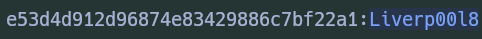

# Easy
>Our client Inlanefreight contracted us to assess individual hosts in their network, focusing on access control. The company recently implemented security controls related to authorization that they would like us to test. There are three hosts in scope for this assessment. The first host is used for administering and managing other servers within their environment.

- [ ] **Examine the first target and submit the root password as the answer.**
		- **`dgb6fzm0ynk@AME9pqu`**

- **Escaneo Nmap:**
	

- **Brute Force FTP:**
	

>Encontramos un id_rsa, que intentaremos crackear, donde conseguimos que la clave es la misma que FTP **7777777**.

>Enumerando el programa conseguimos lo siguiente:

# Medium

>Our next host is a workstation used by an employee for their day-to-day work. These types of hosts are often used to exchange files with other employees and are typically administered by administrators over the network. During a meeting with the client, we were informed that many internal users use this host as a jump host. The focus is on securing and protecting files containing sensitive information.

- [ ] **Examine the second target and submit the contents of flag.txt in /root/ as the answer.**
		- **`HTB{PeopleReuse_PWsEverywhere!}`**

- **Escaneo Nmap**
	

>Ahora tratamos de listar los archivos compartidos con **smbclient**

- **smbclient - Recursos Compartidos**
	

>Vemos que conseguimos **SHARE-DRIVE** pero al intentar loggearnos, nos no lo permite, intentamos de distintas formas, y notamos que la falla era el guion (**-**) el cual daba el problema. Al listar el contenido de la carpeta, encontramos un **Docs.zip** el cual descargamos y trataremos de ver lo que tiene dentro.

- **Doc.zip Extract**
	

>Utilizamos la herramienta **`zip2john`** para poder crear un hash del comprimido, y luego crackear dicho hash con la herramienta **`john`**, obtenemos la contraseña y obtenemos el archivo.

>El archivo de igual manera esta protegido por contraseña, por lo que procedemos a realizar el mismo procedimiento pero esta vez utilizando la herramienta **`office2john`**. Donde conseguimos la contraseña para el archivo: **987654321**.

- **Creds in Documentation.docx**
	

>Intentamos utilizar dichas creds, para el ingreso a la máquina con éxito.

- **Acceso como Jason**
	

>Enumerando el serivicio, revisando las crontabs, permisos de sudoers no conseguimos nada, por lo que intentamos ver los puertos y conexiones abiertos en el sistema, a ver si alguno no es accesible desde afuera, y conseguimos el puerto **3306** de MySQL. Por lo que intentamos conectarnos con las credenciales y lo logramos.

>Enumerando la tabla **creds** de la base de datos **users**, conseguimos las creds, del usuario **dennis**.

- **Dennis Creds - Med**
	

>Nos conectamos como el usuario dennis y este cuenta con más en su escritorio.

- **Dennis Desktop**
	

>En el directorio **.ssh** montamos un servidor simple con python y descargamos en nuestra máquina el **id_rsa** el cual procedemos a crear su hash con **ssh2john** y descifrar con **john**.

- **id_rsa - Med**
	

>Damos permisos al clave privada y la utilizamos para intentar la conexión como Root a la máquina con éxito.

- **root - med**
	

# Hard

>The next host is a Windows-based client. As with the previous assessments, our client would like to make sure that an attacker cannot gain access to any sensitive files in the event of a successful attack. While our colleagues were busy with other hosts on the network, we found out that the user `Johanna` is present on many hosts. However, we have not yet been able to determine the exact purpose or reason for this.

- [ ] **Examine the third target and submit the contents of flag.txt in C:\Users\Administrator\Desktop\ as the answer.**
		- **`HTB{PWcr4ck1ngokokok}`**

>Iniciamos un escaneo con Nmap donde conseguimos varios puertos abiertos a los que podemos intentar acceder con fuerza bruta.

- **NmapScan**
	

>Al intentar la conexión con SMB nos da un error y por lo que intentamos el ataque por fuerza bruta contra el protocolo RDP. Intentamos dicho ataque con el usuario **johanna** y conseguimos la contraseña **1231234!**.

- **Johanna - Evil-WinRM**
	

>En este punto conseguimos un archivo **.kdbx** que corresponde al aplicativo **KeePass** por lo que procedemos a instalarlo y e intentar abrir el archivo, que estaba protegido por contraseña que crackeamos y conseguimos: **Qwerty7!**

- **Usuario David Creds**
	

>De igual manera conseguimos unas posibles credenciales del usuario Michael321:

- **Posibles Creds**
	

>Intentamos usar las credenciales de David con Evil-winRM, pero no tenemos éxito, por lo que procedemos a intentar una conexión con **smbclient** como el usuario **david** a sus recursos compartidos:

- **smbclient - david**
	

>Conseguimos un archivo **.vhd** que procedemos a descargar, dicha extensión representa una unidad de disco duro virtual. Según lo estudiado podemos utilizar bitlocker2john para ver los hashes dentro del backup y luego filtrar el hash de Bitlocker y luego intentar descifrarlo.

- **BitLocker Hash Decrypt**
	- 

>En este proceso conseguimos las credenciales para poder acceder al archivo **123456789!**. Para realizar la montura, en una máquina Windows de Prueba la descargamos y abrimos el archivo. Donde conseguimos los Archivos SAM y SYSTEM, que procedemos a transferir a nuestra máquina atacante.

- **SAM y SYSTEM Files**
	- 

>Luego de transferir los archivos a nuestra máquina utilizamos la herramienta **secretdump.py** para ver los hashes que están dentro los archivos.

- **Secretdump.py Hashes NTLM**
	- 

>Al aplicar un Descifrado con la herramienta Hashcat obtenemos el siguiente resultado:

- **Hashcat Cracked NTLM**
	

>Nos conectamos por medio de **Evil-WinRM** y logramos obtener la Flag correspondiente.

- **Administrator Access Hard**
	- 

# FIN
